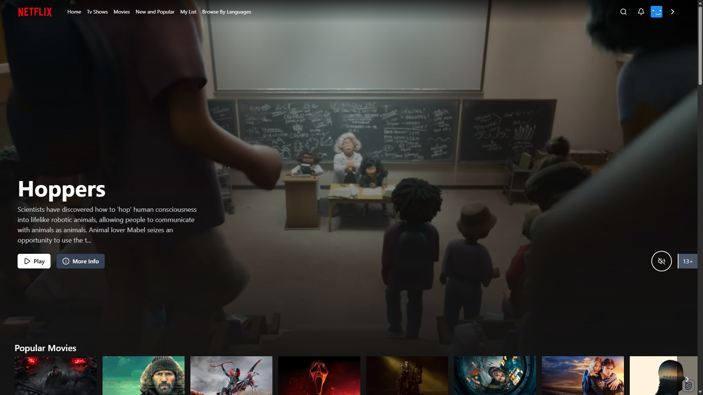
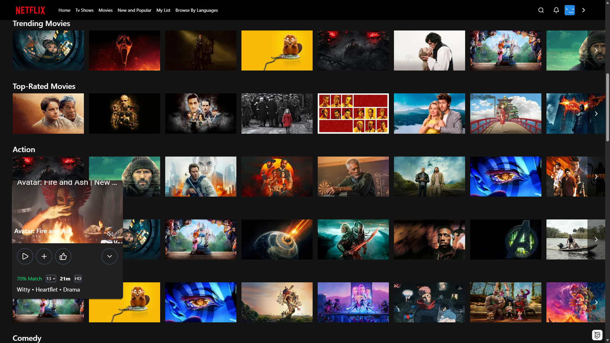
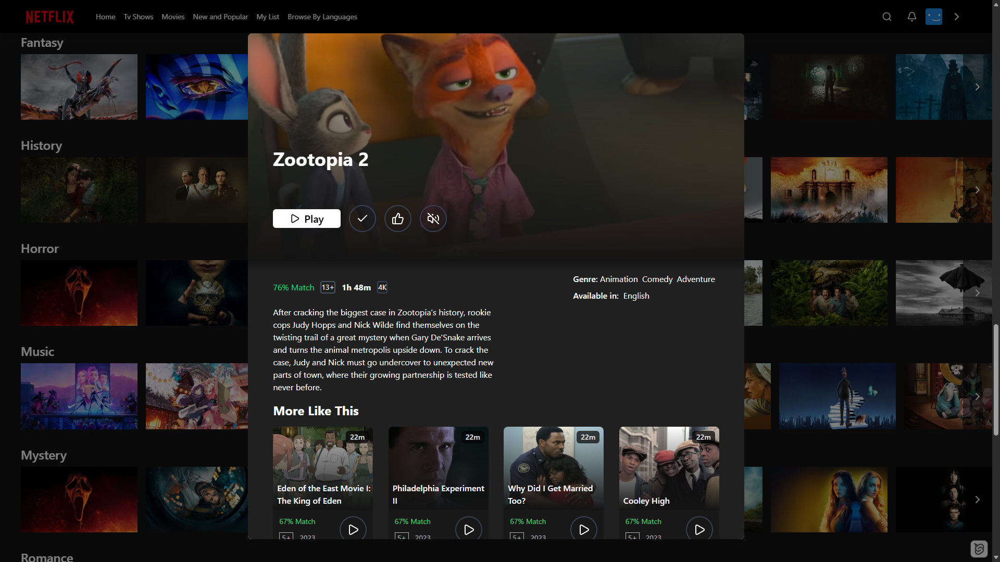
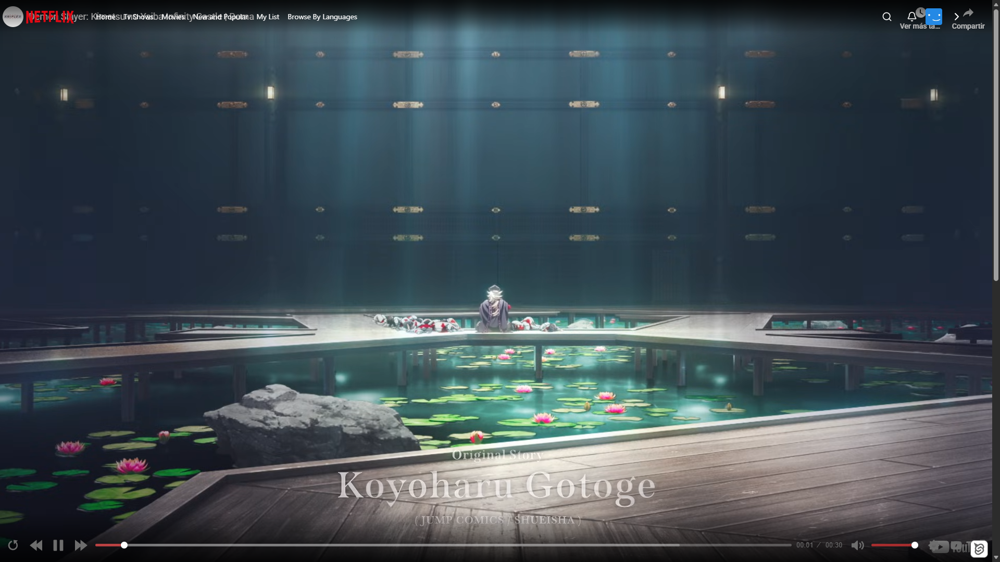

# 🎬 Netflix Clone

A full-featured Netflix clone built with **SvelteKit 2** and **Svelte 5**, featuring a modern UI, video playback, search, and a personal watchlist — all powered by a real movies/TV API.

---

## 📖 Description

This project is a personal take on a Netflix-style streaming platform, developed while following a Udemy course but implemented from scratch with my own design decisions and architectural choices. It replicates the core Netflix experience: browsing a catalogue, viewing movie details in a modal, playing trailers, searching content, and managing a personal list.

---

## 🎓 Based On

This project was built using as a foundation the Udemy course **[SvelteKit Masterclass – Build 20 Complete SvelteKit Projects](https://www.udemy.com/course/sveltekit-masterclass-build-20-complete-sveltekit-projects/)**.

However, the original course project was built with **Svelte 4**, so I took the opportunity to fully migrate and adapt it to **Svelte 5**, adopting the new runes-based reactivity model (`$state`, `$derived`, `$effect`, etc.) and updating the codebase to reflect my own design and implementation decisions.

---

## ✨ Features

- 🏠 **Home Page** – Hero banner with featured content and categorized movie/show rows
- 🔍 **Search** – Real-time search across movies and TV shows
- 🎥 **Video Player** – Full-featured video playback using [Plyr](https://plyr.io/)
- 📋 **My List** – Add and manage a personal watchlist
- 🪟 **Preview Modal** – Quick-peek modal with movie details, trailer preview, and action buttons
- 📱 **Responsive Design** – Fully responsive layout across all screen sizes

---

## 🛠️ Tech Stack

| Technology | Purpose |
|---|---|
| [SvelteKit 2](https://kit.svelte.dev/) | Full-stack framework & routing |
| [Svelte 5](https://svelte.dev/) | UI components with runes |
| [TypeScript](https://www.typescriptlang.org/) | Type safety |
| [Tailwind CSS 4](https://tailwindcss.com/) | Utility-first styling |
| [Plyr](https://plyr.io/) | Video player |
| [Lucide Svelte](https://lucide.dev/) | Icon library |
| [Bun](https://bun.sh/) | Runtime & package manager |
| [Vite](https://vite.dev/) | Build tool & dev server |

---

## 🚀 Getting Started

### Prerequisites

- [Bun](https://bun.sh/) (recommended) or Node.js ≥ 18
- A TMDB API key (see [Environment Variables](#environment-variables))

### Installation

```bash
# Clone the repository
git clone https://github.com/Nyasper/netflix-clone-svelte.git
cd netflix-clone-svelte

# Install dependencies
bun install
```

### Environment Variables

Create a `.env` file in the root of the project and add your API key:

```env
TMDB_API_KEY=your_tmdb_api_key_here
```

> You can get a free API key from [The Movie Database (TMDB)](https://www.themoviedb.org/settings/api).

### Running the Development Server

```bash
bun run dev
```

Then open [http://localhost:5173](http://localhost:5173) in your browser.

### Build for Production

```bash
bun run build
bun run start
```

---

## 📁 Project Structure

```
src/
├── lib/
│   ├── components/     # Reusable UI components (Modal, Player, Navbar, etc.)
│   ├── server/         # Server-side API helpers
│   ├── stores/         # Svelte stores (my list, etc.)
│   ├── types/          # TypeScript type definitions
│   └── helpers.ts      # Shared utility functions
└── routes/
    ├── +page.svelte    # Home page
    ├── search/         # Search page
    ├── watch/          # Video player page
    ├── myList/         # Personal watchlist page
    └── api/            # SvelteKit API endpoints
```

---

## 📸 Screenshots

### Hero Section


### Movie Catalogue


### Preview Modal


### Watch Page


---

## 📜 License

This project is open source and available under the [MIT License](LICENSE).